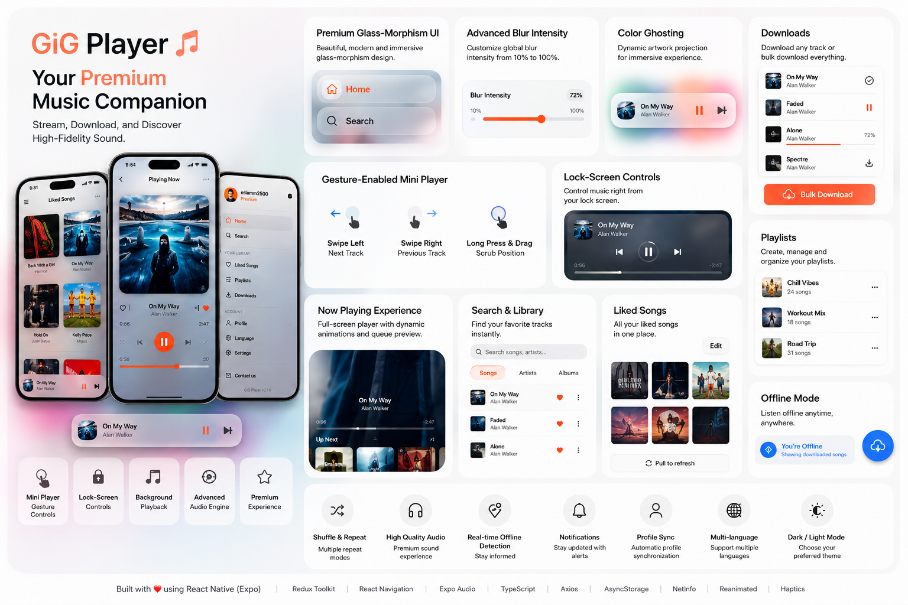

<p align="center">
  
</p>

# GiG Player 🎵

A full-featured music streaming and offline playback app built with React Native (Expo). Stream tracks from a backend API, download them for offline listening, manage playlists, and enjoy a premium audio experience with lock-screen controls and fluid gesture interactions.

---

## Features

### ✨ Premium Experience

- **Glass-Morphism UI**: High-fidelity translucent interface with dynamic blur effects across headers, search bars, and navigation panels.
- **Advanced Blur Control**: Toggle "Advanced Blur" effects and customize the intensity (10% to 100%) globally via app settings.
- **Color Ghosting**: Dynamic visual projection of song artwork behind the MiniPlayer and Drawer for an immersive, color-reactive experience.
- **Floating Curved Drawer**: Modern floating "side sheet" design with `32px` rounded corners and optimized `82%` width.

### 🎧 Audio Playback

- Stream tracks via authenticated API (HTTPS with Bearer token)
- Background audio playback (iOS & Android)
- Lock-screen controls with artwork, seek-forward and seek-backward
- Auto-advance to next track on finish
- Repeat modes: off / repeat track / repeat queue
- Shuffle mode

### 📥 Offline / Downloads

- **Bulk Download everything** via one-tap toggles on lists/playlists
- Download any individual track to local device storage
- Automatic fallback to local file when offline
- Download progress indicator (percentage)
- Cancel active downloads mid-flight
- Delete individual or all downloads
- Storage usage summary

### 🎛 Mini Player

- Persistent floating player with **Glass-Morphism** styling
- **Visual Color Ghosting**: Subtle artwork projection behind the player's glass surface
- **Swipe left** → next track
- **Swipe right** → previous track
- **Long press + drag** → scrub playback position in real time
- Visual arrow hints appear as you drag
- Haptic feedback on all gestures

### 📋 Now Playing Screen

- Full-screen album art with blurred background image
- Music-reactive "breathing" scale animation on album art
- Dynamic accent glow pulsing behind artwork
- Seekable progress slider
- Play / Pause / Next / Previous controls
- Like / Unlike track
- Add to playlist
- Animated "peek" carousel for queue context

### 🗂 Search & Library

- **Redesigned SearchBar**: Pill-shaped translucent search bar with dynamic theme-aware borders.
- Browse all tracks from the API
- Search with debounce to reduce server load
- Add tracks to playlists
- Like / Unlike directly from search results

### 🎵 Local Music Library

- **On-Device Scanning**: Automatically scan for audio files in device storage (Downloads, Music folders).
- **Tabbed Browsing**: Modern swipe-enabled interface to browse local songs by **Song**, **Artist**, **Album**, and **Folder**.
- **ID3 Metadata Extraction**: Automatic extraction of title, artist, album, and embedded cover art from MP3/M4A/FLAC files.
- **Lazy Enrichment**: Performance-optimized metadata extraction that enriches tracks as you browse.
- **Smart Caching**: Indexed local library results are cached for 24 hours for instant startup.
- **Hybrid Playback**: Local tracks work seamlessly with the existing queue, shuffle, and repeat systems.
- **Scan Filters**: Advanced controls to exclude specific folders, filter by minimum file size (0–5 MB), and filter by minimum duration (0–120s) to keep the library clean.

### ❤️ Liked Songs

- Grid view of all liked tracks
- Edit mode with swipe-to-remove badges
- Pull-to-refresh

### 📂 Playlists

- Create and manage playlists
- Playlist detail view with track list
- Swipe-to-delete tracks from a playlist
- Pull-to-refresh

### 🔔 Notifications

- In-app notification feed with icon badges per type

### 👤 Profile

- Side drawer profile synchronization (automatic updates from API)
- View and edit profile info
- Navigate to Notifications and Support

### ⚙️ Settings

- **Advanced Blur Intensity**: Customizable global blur slider (10%-100%)
- Toggle "Advanced Blur" on/off
- Select accent color (dynamic theme color picker)
- Toggle dark / light / system mode
- Language selection
- **Local Music Filtering**: Exclude specific folders from scanning and set minimum file size/duration thresholds to filter out ringtones and short audio clips.
- Contact, FAQ, Terms of Service links

### 🌐 Connectivity

- Real-time offline detection banner
- Auto-collapses to a pill icon after 5 seconds
- Floating "Downloads" FAB when offline
- Unified banner system for all errors and alerts (no system dialogs)

### 🔐 Authentication

- Login / Sign Up screens with validation
- **Guest Mode**: Skip login to access downloaded and local music offline.
- **Persistent Sessions**: Instant app entry via `AsyncStorage` hydration.
- Silent token refresh via Axios interceptors (resilient to network timeouts).
- Auto-login on app restart

---

## Tech Stack

| Category         | Technology                                   |
| ---------------- | -------------------------------------------- |
| Framework        | React Native + Expo SDK 55                   |
| Language         | TypeScript                                   |
| State Management | Redux Toolkit                                |
| Navigation       | React Navigation (Native Stack + Drawer)     |
| Audio            | expo-audio (background + lock screen)        |
| Media Library    | expo-media-library (scanning local storage)  |
| Metadata         | expo-music-info-2 (ID3 tag extraction)       |
| Glass-Morphism   | expo-blur                                    |
| Images           | expo-image (disk cache)                      |
| Gestures         | react-native-gesture-handler                 |
| Animations       | react-native-reanimated                      |
| HTTP Client      | Axios (with interceptor-based token refresh) |
| Storage          | AsyncStorage                                 |
| File System      | expo-file-system                             |
| Haptics          | expo-haptics                                 |
| Network          | @react-native-community/netinfo              |

---

## Project Structure

```
src/
├── components/          # Shared UI components
│   ├── MiniPlayer.tsx       # Gesture-enabled floating player
│   ├── OfflineBanner.tsx    # Unified notification + offline banner
│   ├── DownloadButton.tsx   # Download / cancel / remove button
│   ├── AuthInitializer.tsx  # App bootstrap + auth hydration
│   ├── PlaylistPicker.tsx   # Bottom sheet playlist picker
│   ├── NowPlaying/          # Now Playing sub-components
│   └── ...
├── screens/             # Full application screens
│   ├── Auth/                # Login, SignUp, Welcome
│   ├── Home/                # Home feed + track list
│   ├── Library/             # Search / browse
│   ├── LikedSongs/          # Liked songs grid
│   ├── Playlist/            # Playlist list + detail
│   ├── Downloads/           # Offline library
│   ├── NowPlaying/          # Full player
│   ├── Profile/             # User profile
│   ├── Settings/            # App settings
│   ├── LocalLibrary/        # **NEW**: Local music tabs + detail views
│   ├── Notifications/       # Notifications
│   ├── Support/             # Support page
│   ├── Contact/             # Contact form
│   ├── FAQ/                 # FAQ page
│   ├── Language/            # Language picker
│   └── Legal/               # Terms of Service
├── navigation/          # AppNavigator + DrawerNavigator
├── redux/store/         # Redux slices
│   ├── auth/                # Auth state (login, profile, token)
│   ├── player/              # Playback state (track, queue, progress)
│   ├── library/             # Track library cache
│   ├── downloads/           # Downloaded tracks + progress
│   ├── theme/               # Dark mode + accent color
│   ├── localLibrary/        # **NEW**: Indexed local device tracks
│   └── ui/                  # Global UI state (banner messages)
├── services/
│   ├── api/                 # Axios client, auth, library, download services
│   ├── local/               # **NEW**: Local device music scanning & ID3 logic
│   ├── audio/               # AudioPlayerService singleton
│   ├── auth/                # Token read/write (AsyncStorage)
│   ├── logic/               # Screen logic hooks
│   └── storage/             # Theme preferences persistence
├── hooks/               # useThemeColor, useAccentColor
├── constants/           # Theme tokens, accent colors
├── types/               # Global TypeScript types
└── utils/               # Validation helpers
```

---

## Getting Started

### Prerequisites

- Node.js ≥ 18
- Expo CLI (`npm install -g expo-cli`)
- Android Studio (for Android builds) or Xcode (for iOS builds)
- A running backend API (configured in `src/services/api/axiosClient.ts`)

### Install

```bash
git clone <repo-url>
cd music-player
npm install
```

### Run (Development)

```bash
# Start Expo dev server
npx expo start

# Android (with dev client)
npx expo run:android

# iOS
npx expo run:ios
```

### Build (Production)

```bash
# Install EAS CLI
npm install -g eas-cli

# Configure (first time)
eas build:configure

# Android APK / AAB
eas build --platform android

# iOS IPA
eas build --platform ios
```

---

## Key Architecture Decisions

### Unified Messaging via `OfflineBanner`

All user-facing messages (errors, success, warnings, info) go through the `OfflineBanner` component driven by the `ui` Redux slice. No `Alert.alert` dialogs are used anywhere in the app. Messages auto-dismiss after 3 seconds; offline status persists until connectivity is restored.

### Audio as a Singleton Service

`AudioPlayerService` is a singleton that manages a single `expo-audio` player instance. It handles track loading, lock-screen metadata, progress dispatch (throttled to 500ms), auto-next-on-finish, and offline/streaming source resolution transparently.

### Image Caching

All images use `expo-image` with `contentFit="cover"` for automatic disk caching, reducing network usage on repeated views.

### Token Refresh

Axios interceptors silently refresh expired access tokens using the stored refresh token before retrying the original request. No user action required.

### Gesture-First Mini Player

The mini player uses `react-native-gesture-handler`'s `Gesture.Pan()` API composed with `Gesture.Simultaneous()` so swipe-to-change-track and long-press-to-scrub can coexist without conflict, both running on the UI thread via Reanimated shared values.

### Local Music Scanning & Caching

The local library feature uses `expo-media-library` to recursively scan for audio assets. To handle large libraries (1000+ songs) efficiently, the scan is paginated and the results are indexed into Redux and cached in `AsyncStorage` with a 24-hour TTL. ID3 metadata (including cover art) is extracted "lazily" using `expo-music-info-2` only when a user navigates to a specific album or artist detail, ensuring the initial scan remains fast.

### Runtime Dependency Injection

To prevent Metro bundler `Require cycle` loops that cause sporadic `undefined` errors (e.g. from circular imports like `components -> store -> slice -> service -> components`), services such as `DownloadService` leverage run-time dependency injection (`injectRedux`), initialized safely inside `AppBootstrap`.

---

## Permissions

| Permission                          | Reason                                    |
| ----------------------------------- | ----------------------------------------- |
| `INTERNET`                          | Stream audio and fetch track data         |
| `FOREGROUND_SERVICE`                | Background audio playback (Android)       |
| `FOREGROUND_SERVICE_AUDIO_PLAYBACK` | Lock screen controls (Android)            |
| `WAKE_LOCK`                         | Keep audio alive while screen is off      |
| `ACCESS_NETWORK_STATE`              | Detect offline/online status              |
| `READ_MEDIA_AUDIO`                  | Access local audio files (Android 13+)    |
| `READ_EXTERNAL_STORAGE`             | Access local audio files (Legacy Android) |

---

## Changelog

### v2.5.0 (May 2026)

- **🚫 Guest Mode**: Added full offline mode allowing users to bypass authentication to play downloaded and local tracks. Cloud features are dynamically hidden.
- **💾 Persistent Sessions**: Rebuilt auth bootstrap. The user session now loads instantly from `AsyncStorage`, completely bypassing the splash screen block.
- **📶 Network Resilience**: The API client no longer logs users out if a background token refresh fails due to a network timeout.
- **🧹 Queue Swipe-to-Delete**: Users can now swipe to remove tracks directly from the active playback queue.

### v2.4.0 (May 2026)

- **⚡ FlashList Integration**: Migrated all major list views to `@shopify/flash-list`, providing butter-smooth 60FPS scrolling even with thousands of local tracks.
- **⏲️ Sleep Timer**: Added customizable sleep timer (15/30/60m) accessible via Settings and Now Playing controls.
- **🔄 Queue Management**: Complete overhaul of the playback queue. Users can now view the upcoming queue, drag-to-reorder tracks, and add songs to "Play Next".
- **🕒 Recently Played**: Added history tracking. Your home screen now features a "Recently Played" section for quick access to your last 20 tracks.
- **🛡️ Local Music Filters**: Advanced settings to filter out small files (<1MB), short audio clips (<30s), and exclude specific folders from indexing.
- **🎨 UI Polish**: Improved music icon fallbacks for tracks without artwork and refined Glass-Morphism intensities across the app.

---

## License

Private — all rights reserved.
